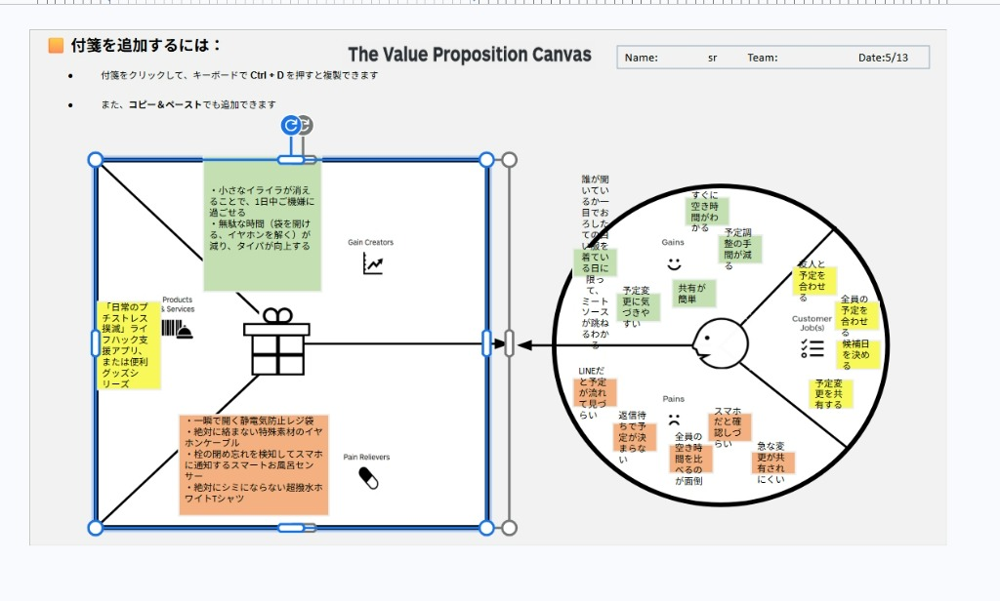

# VPC v1 - yu_ta_103

> 「**自分や周りの人を顧客に設定**」したVPC。13週後の自分が欲しいもの・身近な人のために作りたいものを設計する。
> v1 でいい。完璧を目指さない。第6回でアップデート(v2)します。

---

## 1. 解決したい困りごとを 1つ 選ぶ

> [`bug-list.md`](./bug-list.md) の20個から、**「自分が一番これを解決したい!」と思うもの** を1つ選んでください。

**選んだ困りごと**:

20. おろしたての白い服を着ている日に限って、ミートソースやコーヒーを飛ばす

---

## 2. その解決策のアイデアを書く

> 選んだ困りごとに対する「**こうだったらいいのに**」を1つ書く。
> 現実性は気にせず、自由に発想。

**解決のアイデア**:

絶対にシミにならない超撥水ホワイトTシャツの開発、および日常のプチストレス（レジ袋が開かない、イヤホンが絡まる、お風呂の栓閉め忘れ等）を撲滅する便利グッズ/アプリの展開。

---

## 3. VPC本体

> 上で選んだ「困りごと」と「解決のアイデア」を起点に、6要素を埋めていきます。

### 🟦 Customer Profile(顧客=自分自身)

#### Jobs(やりたいこと・動詞で書く)

- 友人と予定を合わせる
- 全員の予定を合わせる
- 候補日を決める
- 予定変更を共有する

#### Pains(困っていること)

- スマホだと確認しづらい
- 急な変更が共有されにくい
- 全員の空き時間を比べるのが面倒
- 返信待ちで予定が決まらない
- LINEだと予定が流れて見づらい
- おろしたての白い服を着ている日に限って、ミートソースが跳ねる

#### Gains(得たい未来・状態)

- すぐに空き時間がわかる
- 予定調整の手間が減る
- 共有が簡単
- 予定変更に気づきやすい
- 誰が開いているか一目でわかる

---

### 🟧 Value Map(あなたが作るもの)

#### Products & Services

- 「日常のプチストレス撲滅」ライフハック支援アプリ、または便利グッズシリーズ

#### Pain Relievers

- 一瞬で開く静電気防止レジ袋
- 絶対に絡まない特殊素材のイヤホンケーブル
- 栓の閉め忘れを検知してスマホに通知するスマートお風呂センサー
- 絶対にシミにならない超撥水ホワイトTシャツ

#### Gain Creators

- 小さなイライラが消えることで、1日中ご機嫌に過ごせる
- 無駄な時間（袋を開ける、イヤホンを解く）が減り、タイパが向上する

---

## 4. Fit確認(整合チェック)

| Pains/Gains | ↔ | Pain Relievers / Gain Creators | チェック |
|---|---|---|---|
| おろしたての白い服を着ている日に限ってミートソースが跳ねる | ↔ | 絶対にシミにならない超撥水ホワイトTシャツ | ✓ |
| 返信待ちで予定が決まらない | ↔ | (スケジュール調整の解決策がマップ側に入っていないため未対応) | ✗ |
| LINEだと予定が流れて見づらい | ↔ | (スケジュール調整の解決策がマップ側に入っていないため未対応) | ✗ |
| スマホだと確認しづらい | ↔ | (スケジュール調整の解決策がマップ側に入っていないため未対応) | ✗ |
| 全員の空き時間を比べるのが面倒 | ↔ | (スケジュール調整の解決策がマップ側に入っていないため未対応) | ✗ |
| 急な変更が共有されにくい | ↔ | (スケジュール調整の解決策がマップ側に入っていないため未対応) | ✗ |
| 予定調整の手間が減る | ↔ | 無駄な時間が減り、タイパが向上する | ✓ |
| すぐに空き時間がわかる | ↔ | (対応するGain Creatorなし) | ✗ |

> 整合しないものは「自分が作りたいだけ」のプロダクトになりがち。
> 迷ったら AI大学講師に壁打ち。

---

> [!NOTE]
> スケジュール調整に関する顧客課題（円の右側）と、日常のプチストレスを解決するプロダクト案（四角の左側）が混在しているため、第6回のVPC v2アップデート時に整理・ブラッシュアップを行う予定です。

⠀
